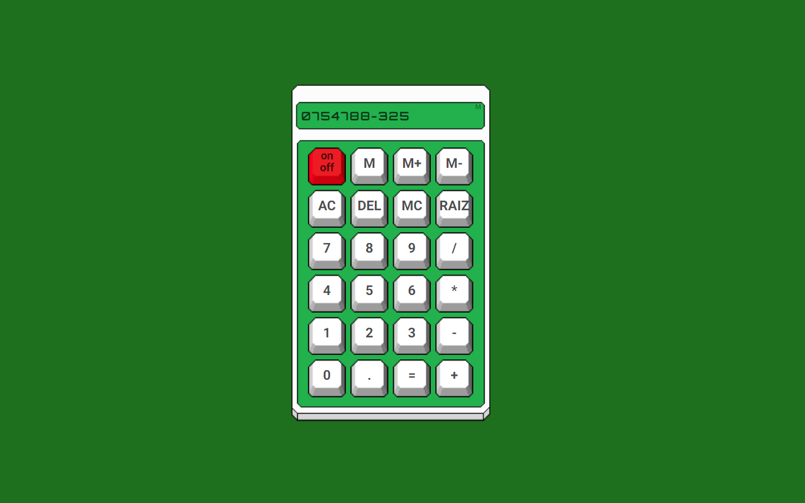

# Calculadora-pixel-art

Esse é um projeto onde utilizo o CSS, JavaScript em conjuto para criar um efeito de realismo a calculadora.

Tecnologias: -Html -Css -JavaScript

<a href="https://jadsonps.github.io/Calculadora-pixel/"> https://jadsonps.github.io/Calculadora-pixel/ </a>

